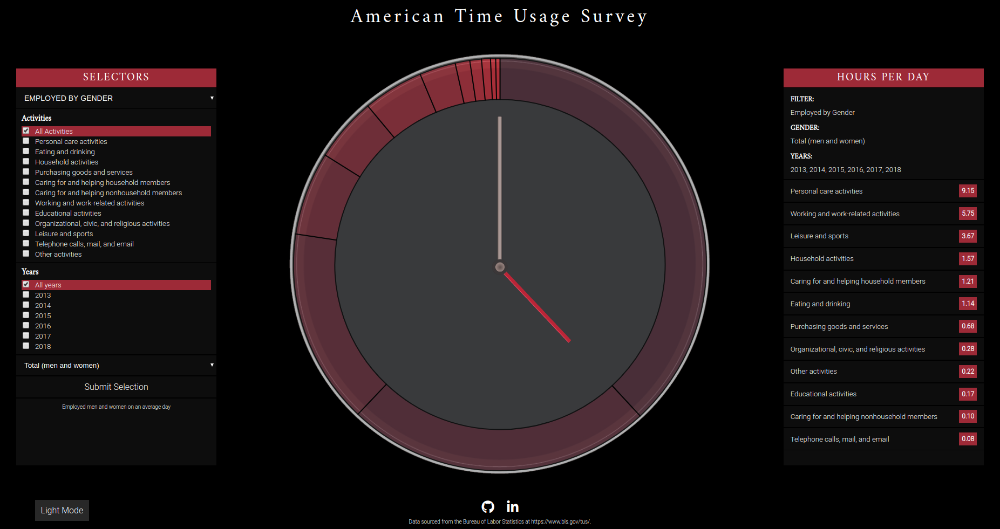

# Time Usage

## Background and Overview
Time Usage is a data visualization of survey results from the American Time Usage Survey (ATUS), conducted from 2009 to 2018, by the Bureau of Labor Statistics. The data is largely in average hours per day, categorized by the type of day (e.g. nonholiday weekday), and occasionally by other relevant categories (e.g. gender). More information about the survey can be found on [their website](https://www.bls.gov/tus/).

[Click here](https://rayoowoo.github.io/TimeUsage) for the live app.

## Architecture and Technologies

* Vanilla Javascript to handle the selecting logic and shaping the data received from ATUS.
* D3.js for injecting data into the DOM and manipulating the DOM based on the injected data.
* CSS for styling the visulization
* SCSS for modular CSS structure
* Themify for employing CSS themes
* Webpack for bundling scripts for modular composition of Javascript files


## Features
Time Usage is a fairly simple application with a few main features:

### Filtering data
User interactivity is primarily centered around the selection menu on the left side of the screen. There are six primary categories:
1. Employed persons by gender
2. Comparison of one activity, with employed persons, by gender
3. Everyone by type of day
4. Comparison of one activity, with everyone, by type of day
5. App Academy student
6. First year medical resident at UCSF
Additionally, the first four options also have a selection based on years. 

The data I gathered from the ATUS website came in the format of spreadsheet tables. Because Time Usage is written in Javascript, it needs the data to be formatted as a JSON object. To accomplish this, the data from the spreadsheet was converted into a CSV, and fed through a [CSV to JSON parser](https://www.csvjson.com/csv2json). The data I had received was now an array of JSON objects. In order for the filters to easily select various parameters from the JSON object, it needed to look like this:
```
{
    "Personal care activities": {
        "activity": "Personal care activities",
        "category": "Y",
        "Men": {
            "2013": 8.88,
            ...
        },
        "Total (men and women)": {
            "2013": 9.1,
                ...
        },
        "Women": {
            "2013": 9.36,
            ...
        },
        ...}
```
The following script trimmed and reshaped the JSON object to fit the needs of the filters:
```
let data = {};
for (let i = 0; i < employedByGender.length; i++) {
  const datum = employedByGender[i];
  const title = datum["Series Title"];
  const gender = datum.Gender;
  delete datum['Category?']
  delete datum.ID;
  delete datum['Series ID'];
  delete datum.Gender;
  delete datum['Series Title'];
  delete datum[''];
  data[title + '-' + gender] = {
      activity: title,
      [gender]: datum
    }
  };
```

### D3 Data visualization
At the center of the application is the d3 donut graph visualization of the filtered data. The hardest aspect of this graph was the loading of the graph in a clockwise fashion. 


The loading animation is a feature of D3 transitions, where the path of the arc is drawn out over a duration of time. However, D3 transitions are independent from one another, meaning that the transitions for one path is independent from another path. As a result, there is no built in way to chain the transitions of separate objects together. In order to have the graph load in a sequential fashion, each path needed to have a calculated delay that matched the timing of the previous arc's transition ending. To accomplish this, I first assigned each arc to have a percentage value based on how much of the total that arc was to occupy of the donut:

```
processed_data.forEach(d => {
    d.percentage = d.value / total;
})
```
Each path would then need to have their delay calculated dynamically, as the number of data points on the graph changes based on the parameters the user selects. The duration of each arc path loading would be its corresponding percentage of a total 3 seconds. The delay for each arc, therefore, would be the total duration of all the transitions preceding it. However, D3 node collections are not arrays, so there was some going back and forth between converting the collection to an array and back to a collection.
```
utils.arraySum(paths.nodes().slice(0, i).map(el => d3.select(el).data()[0].data.percentage)) * 3000 + 200;
```

### Dark mode
Dark mode was added for increased accessibility on this web application. 

In order to implement dark mode, various elements that are usually white on the default look must be toggled to black, and vice versa when switching back. Instead of writing essentially two sets of CSS classes to account for such a toggling, I used an awesome and simple [themify mixin](https://gist.github.com/dmitru/39245f9e702dad9b04d504c549fc1814#file-scss-theming-5-themify-scss) from [dmitru](https://github.com/dmitru), found on his [great medium article](https://medium.com/@dmitriy.borodiy/easy-color-theming-with-scss-bc38fd5734d1). All I needed to do was to define a theme:

```
$themes: (
    light: (
        oneColor: white,
        otherColor: black,
        ...
    ),
    dark: (
        oneColor: black,
        otherColor: white,
        ...
    )
)
```
Then, within my sass files, I needed to import that theme file, import the themify mixin, and include the relevant variables on my selectors:
```
.selectors-select {
    @include themify($themes) {
    border-color: themed('oneColor');
    color: themed('otherColor');
    }
}
```
Finally, in order to toggle dark mode, a button on the bottom left of the screen would change the class of a root DOM element from `theme-light` to `theme-dark`, and all the CSS variables change accordingly.

### Other features
* Instruction modal that walksthrough the usage of the website and some disclaimers
* Hover effects on the donut graph and on the displayed data


## Future Implementations
* Incorporating an API rather than gathering raw data for up-to-date survey results